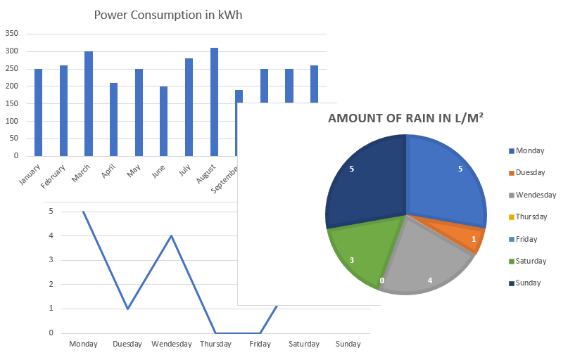
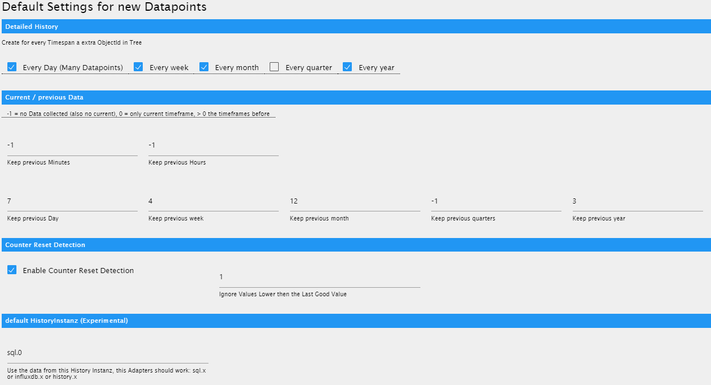

# ioBroker.valuetrackerovertime

**Tests:** 

## valuetrackerovertime adapter for ioBroker
Tracks all numbers and their increase/decrease. The data then will be used to build statistics on the rate of change, displayed in times such as hours, days, weeks, months, quarters and years. The collected data can be used to visualize i.e. the power consumption in charts.

## Settings
Settings for the ValueTrackerOverTime will be done in two places. The default settings will be handled in the instance of the adapter itself, the settings for the individual datapoints will be done in the datapoints containing the data to be tracked.

### Default settings

These are the default settings which will be prompted whenever you activate ValueTrackerOverTime on a datapoint. For each datapoint those can be customed, but the initial values most commoly used) are set here as default values so later you don't have to make to many modifications.

#### Detailed history
In the secion "Detailed History", the datapoints to be created will be selected. Will you want to collect the data for every
* day
* week
* month
* quarter (of a year)
* Year

#### Current / previous data
In the section "Current / previous data" you are able to select how long you want to keep the collected data for every ValueTrackerOverTime-datapoint which is generated for each timeframe.
It makes sense to stop collecting the data once it ends up within another datapoint (for example: After 7 days, the data can be found  cummulated in a week. After 4 weeks the data will find itself in a month...)

#### Counter Reset Detection
This value should always beenabled and set to one. It helps the ValueTrackerOverTime to make correct readings after a value in the original datapoint is being resettet.

### Datapoint settings

In this setting you have to give a nema which will be used as the datapoint name for this selecion node. Additionally you have to give the unit you want the data to be collected in.
So if you want to measure the amount of rain, you can add the unit l/m² or you want to measure the amount of consumed enery as Watt hours (kWh).
In case the datapoint itself uses a different unit (i.E. Wh) you can add a multiplier here (i.e. 60 or 1/60) to converse the data into the required unit.

The rest of the settings will overwrite the default settings which have been set in the adapter instance.

## Datapoints
Depending on the selected timeframes to be collected, the adapter will create for each datapoint you want to track, its own datapoints.

In the picture there are three examples given. Since the screenshot was taken on January 3rd (beginning of new Year/Month), please excuse that the data is not that colorful and divers.
* You can see that today it was a Rain Counter (Regenmenge) of 0.3 l/m² which did not change the entire week.
* The sun did not shine at all during this winters week (for my weahter station it means that it did not get any grighter than 4,500lm any day)
* The energy consumtion however will show you that the current day for the computer is set to 0.351kWh, the week is set to 1.909 kWh and the year is set to 1.393 kWh (which is because today is Sunday and the week is already 7 days old, but it is also the 3rd of January which makes the year only three days old).

## Changelog
### 0.3.2
* (Omega236) reemove selectID.js from index_m.html
### 0.3.1
* (Omega236) first public
### 0.0.1
* (Omega236) initial release

## License
MIT License

Copyright (c) 2020 Omega236 <general.of.omega@googlemail.com>

Permission is hereby granted, free of charge, to any person obtaining a copy
of this software and associated documentation files (the "Software"), to deal
in the Software without restriction, including without limitation the rights
to use, copy, modify, merge, publish, distribute, sublicense, and/or sell
copies of the Software, and to permit persons to whom the Software is
furnished to do so, subject to the following conditions:

The above copyright notice and this permission notice shall be included in all
copies or substantial portions of the Software.

THE SOFTWARE IS PROVIDED "AS IS", WITHOUT WARRANTY OF ANY KIND, EXPRESS OR
IMPLIED, INCLUDING BUT NOT LIMITED TO THE WARRANTIES OF MERCHANTABILITY,
FITNESS FOR A PARTICULAR PURPOSE AND NONINFRINGEMENT. IN NO EVENT SHALL THE
AUTHORS OR COPYRIGHT HOLDERS BE LIABLE FOR ANY CLAIM, DAMAGES OR OTHER
LIABILITY, WHETHER IN AN ACTION OF CONTRACT, TORT OR OTHERWISE, ARISING FROM,
OUT OF OR IN CONNECTION WITH THE SOFTWARE OR THE USE OR OTHER DEALINGS IN THE
SOFTWARE.
